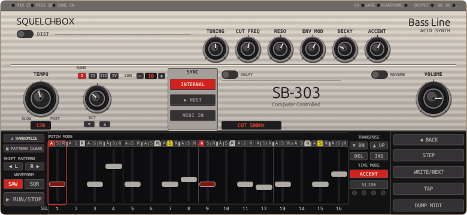

# SquelchBox

A FOSS TB-303-style acid bassline synthesizer plugin. VST3 + CLAP + standalone.

Built with Rust, [nih-plug](https://github.com/robbert-vdh/nih-plug), and egui.



## Listen

[squelchbox_demo.mp3](assets/squelchbox_demo.mp3) — 320 kbps · ~1 minute · download and play locally.

## Features

- **Oscillator** -- bandlimited saw + square (BLIT/polyBLEP), drift LFO for analog warmth
- **3-pole diode ladder filter** -- self-oscillating, with 2x oversampling via half-band polyphase
- **Envelopes** -- exponential amp, one-shot filter (attack-decay), dedicated accent envelope
- **16-step sequencer** -- per-step pitch/accent/slide/rest, pattern length 1-16, swing, 4-bank pattern memory
- **Sync modes** -- Internal (free-run), Host (DAW transport slave), MIDI (keyboard only)
- **FX chain** -- Diode distortion, tempo-synced delay (analog/clean), Schroeder reverb, brickwall limiter
- **Slide/glide** -- portamento between legato steps, authentic 303 slide behavior
- **Computer keyboard** -- chromatic note input, step editing, tap tempo, pattern randomizer
- **MIDI export** -- dump patterns as .mid files

## Install (prebuilt binaries)

Download the latest release for your platform from the [Releases](https://github.com/Hornfisk/squelchbox/releases) page.

Each archive contains VST3, CLAP, and standalone binaries plus an install script.

### Linux

```bash
tar xzf squelchbox-linux-x86_64.tar.gz
./install.sh
# Rescan plugins in your DAW
```

Installs to `~/.vst3/`, `~/.clap/`, and `~/.local/bin/`.

### macOS

```bash
tar xzf squelchbox-macos-arm64.tar.gz   # or macos-x86_64
./install.sh
# Rescan plugins in your DAW
```

Installs to `~/Library/Audio/Plug-Ins/VST3/`, `~/Library/Audio/Plug-Ins/CLAP/`, and `~/.local/bin/`.

Binaries are unsigned. On first launch: right-click > Open, or run:
```bash
xattr -dr com.apple.quarantine squelchbox-standalone
```

**Standalone note:** Use the included `squelchbox-macos.sh` launcher instead of running `squelchbox-standalone` directly. CoreAudio delivers variable-sized buffers that can exceed the configured size, causing a panic in nih-plug's CPAL backend. The launcher passes `--period-size 4096` to accommodate this. See [nih-plug#266](https://github.com/robbert-vdh/nih-plug/issues/266).

### Windows

Extract the `.zip` and run `install.bat` (may need Administrator for the VST3/CLAP paths).

Installs VST3 to `%CommonProgramFiles%\VST3\`, CLAP to `%CommonProgramFiles%\CLAP\`, and standalone to `%LocalAppData%\SquelchBox\`.

**Standalone note:** Use `SquelchBox.bat` (not `squelchbox-standalone.exe` directly). WASAPI in shared mode delivers buffers in the device's native period (often 1056-1266 samples on Windows 11), exceeding nih-plug's default 512-sample buffer. The launcher passes `--period-size 2048` to avoid this.

### Arch Linux (AUR)

```bash
paru -S squelchbox     # or yay, makepkg, etc.
```

Installs VST3 and CLAP system-wide to `/usr/lib/vst3/` and `/usr/lib/clap/`, standalone to `/usr/bin/squelchbox`.

### Verify checksums

Each release includes a `SHA256SUMS.txt`. After downloading:

```bash
sha256sum -c SHA256SUMS.txt
```

## Build from source

Requires Rust stable 1.75+ (or nightly).

```bash
# Check / test
cargo check
cargo test

# Bundle VST3 + CLAP
cargo xtask bundle squelchbox --release

# Install (Linux)
rm -rf ~/.vst3/squelchbox.vst3
cp -r target/bundled/squelchbox.vst3 ~/.vst3/
cp -f target/bundled/squelchbox.clap ~/.clap/

# Standalone (Linux — match your PipeWire/JACK sample rate)
cargo run --release -- --sample-rate 44100 --period-size 512
```

## Project structure

```
src/
  lib.rs              -- crate root
  plugin.rs           -- nih-plug Plugin impl, process loop
  params.rs           -- parameter definitions (knobs, toggles, FX)
  kbd.rs              -- keyboard/MIDI event queue (GUI <-> audio)
  main.rs             -- standalone entry point

  dsp/
    oscillator.rs     -- bandlimited saw + square
    envelope.rs       -- amp, filter, accent envelopes
    filter_diode.rs   -- 3-pole diode ladder (bilinear transform)
    oversampler.rs    -- 2x half-band polyphase up/downsample
    voice.rs          -- monophonic voice: osc + filter + envelopes
    fx/               -- distortion, delay, reverb, limiter, FxChain

  sequencer/
    clock.rs          -- tempo clock with swing
    pattern.rs        -- 16-step pattern + 4-slot bank
    runtime.rs        -- sequencer state machine

  ui/
    mod.rs            -- editor entry point (create())
    ids.rs            -- centralized egui ID registry
    palette.rs        -- colors + layout constants
    widgets.rs        -- param knob, button painters
    keyboard.rs       -- keyboard input, pattern persistence
    panels/           -- faceplate, band1, band2, fx_dist, fx_time, toast
      lower/          -- left strip, pitch row, step grid, transpose, right strip

  util/
    paths.rs          -- XDG data/config/preset directories
    midi_export.rs    -- pattern-to-MIDI file export
```

## Dependencies

| Crate | Purpose |
|-------|---------|
| [nih-plug](https://github.com/robbert-vdh/nih-plug) | Plugin framework (VST3/CLAP/standalone) |
| [nih_plug_egui](https://github.com/robbert-vdh/nih-plug) | egui integration for plugin GUIs |
| parking_lot | Fast mutexes for audio/GUI sync |
| rtrb | Lock-free SPSC ring buffer |
| serde + serde_json | Pattern bank persistence |
| tracing | Structured logging |

## License

[GPL-3.0-or-later](LICENSE) -- required by nih-plug's license.
